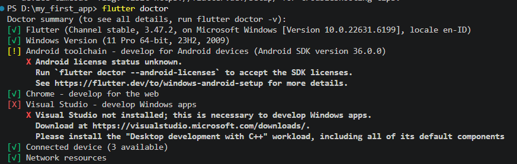
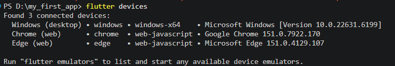

# Week 1 - Mobile Development Flutter Refresh

Learning the basics of Dart and Flutter and created a simple Student Profile application using basic Flutter widgets.

### Mini Assignment Main Feature

This project is a simple student profile app built with Flutter. It presents the student's personal and academic information in a centered layout. The profile shows the student's name, student ID, study program, and university.

### Tech Stack

1. Flutter
2. Dart

### Refleksi
1. When is native development more appropriate than cross-platform development?

Native development is more appropriate when an app needs maximum performance or special access to features from a specific platform.

2. How does a state change relate to the widget tree and declarative UI?

State stores data or conditions that can change in an app. When the state changes, the widgets are rebuilt, so the UI is updated based on the new state.

3. Why are small commits with clear messages useful for teamwork and a portfolio?

Small commits with clear messages make teamwork easier because they make changes easier to understand and track. For a portfolio, commit messages can also show the development process of the project.

### Notes

- Flutter SDK is detected, but there is still an issue with the Android SDK. The Android SDK Command-line Tools are not properly configured, and the Android license status cannot be verified yet.

- Flutter successfully detects several devices, including Chrome.

- **Hot Reload vs Hot Restart:** Hot Reload is used to quickly see code changes without restarting the application from the beginning. Meanwhile, Hot Restart restarts the application from the beginning, so the current application state is reset.