# Week 2 - Declarative UI & Responsive Design

## Warmup

### 1. Remove Expanded

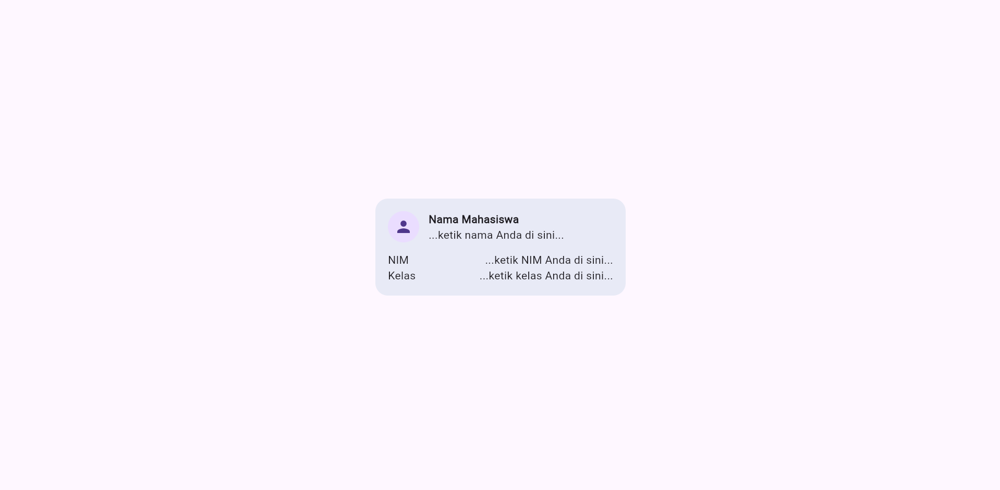

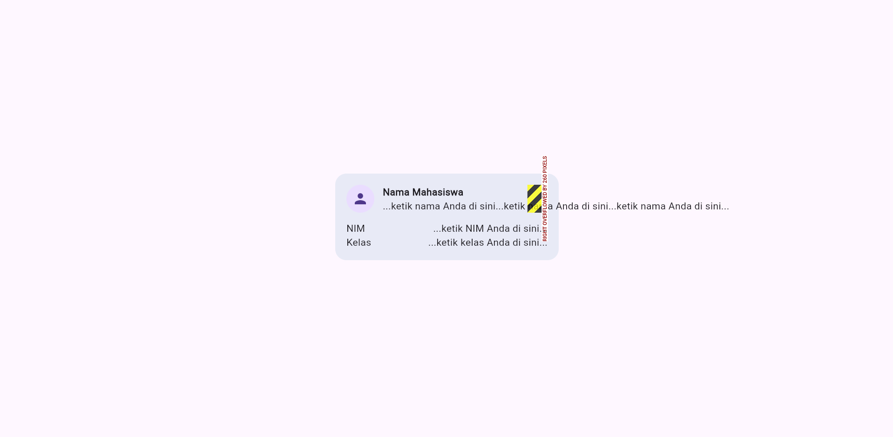

I removed `Expanded` from the name row and checked the layout. It can cause layout problems when the space is limited.

### 2. Change mainAxisSize

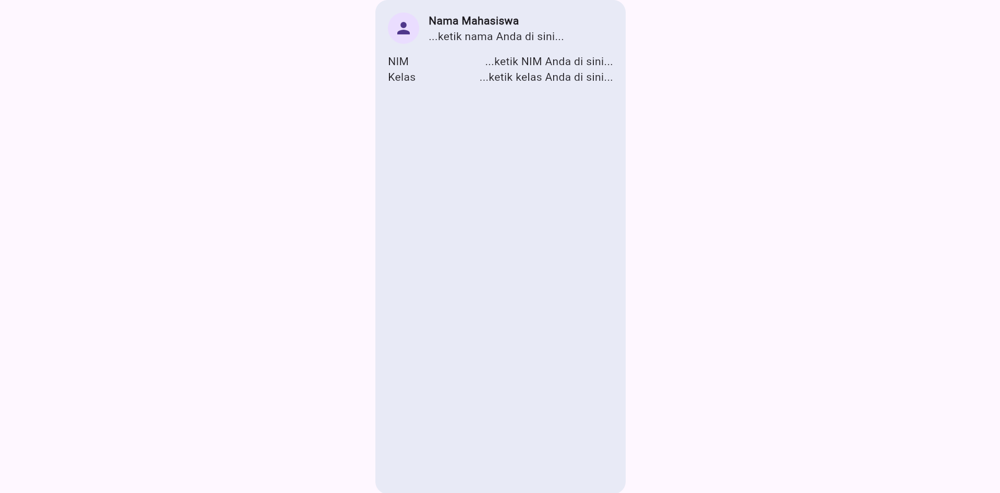

I changed `MainAxisSize.min` to the default value. The card became taller because the Column used more available space.

### 3. Add Email Row

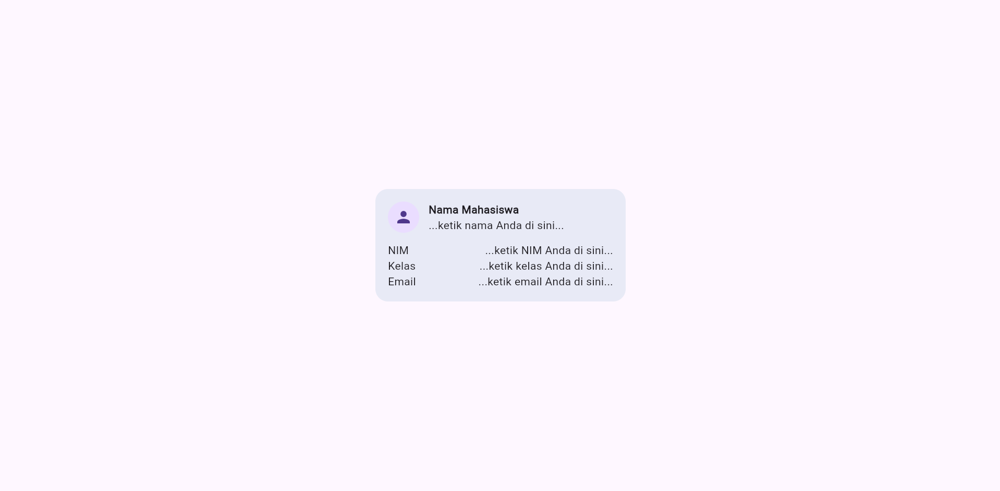

I added an Email row using the same `Row` and `Expanded` pattern.

---

## Practical Lab

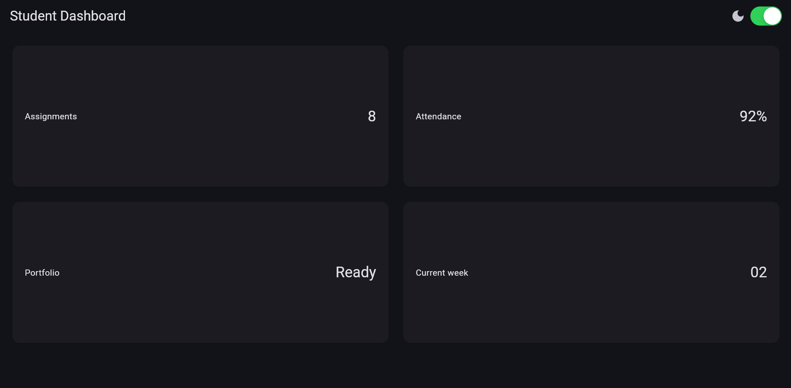
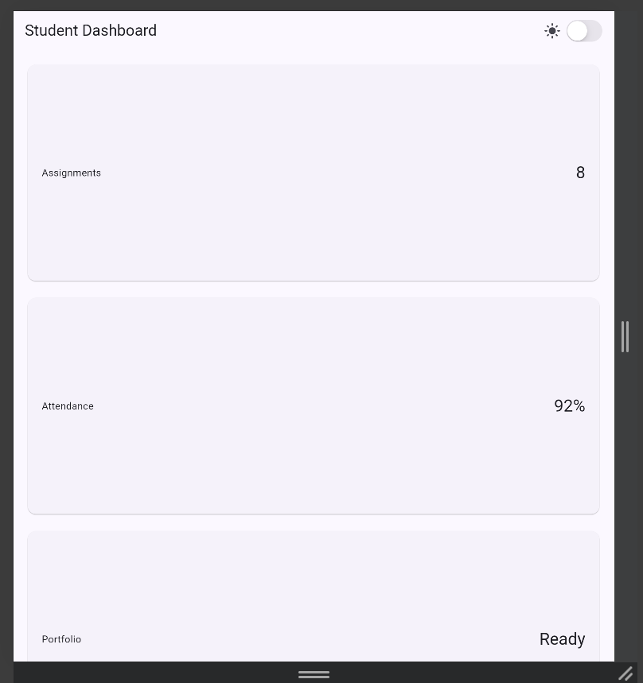
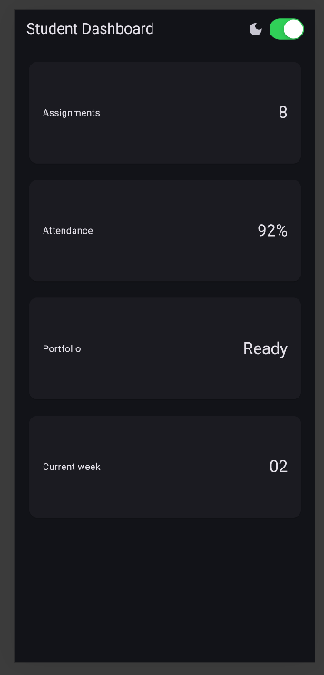

---

## Layout experiments

### 1. Change the 700 breakpoint

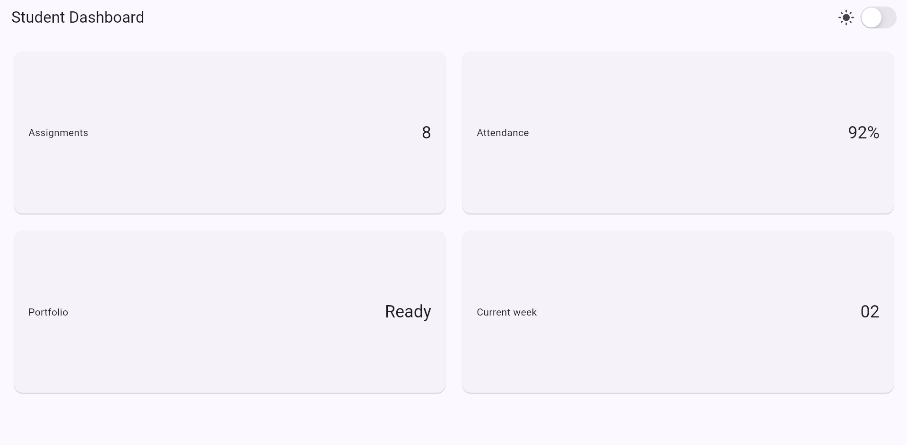
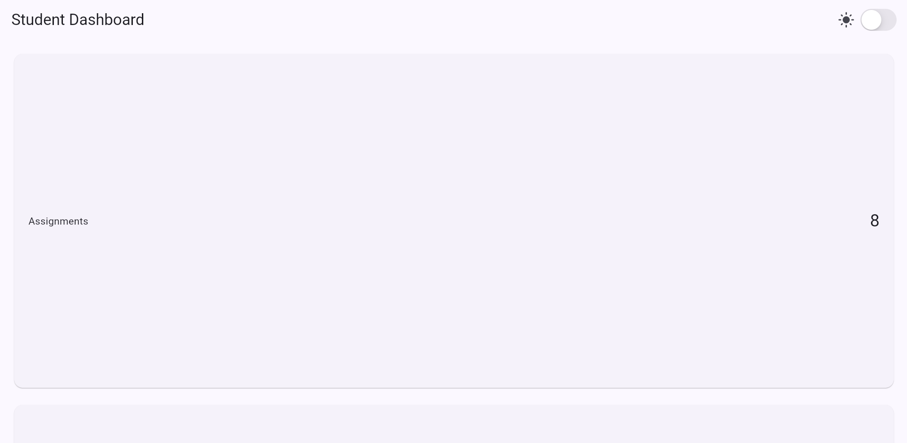

I changed the breakpoint to 1000.

### 2. Change the theme

I changed the theme to `ThemeMode.dark` and then restored the original setting.

---

## Main Task

### Academic Overview Page

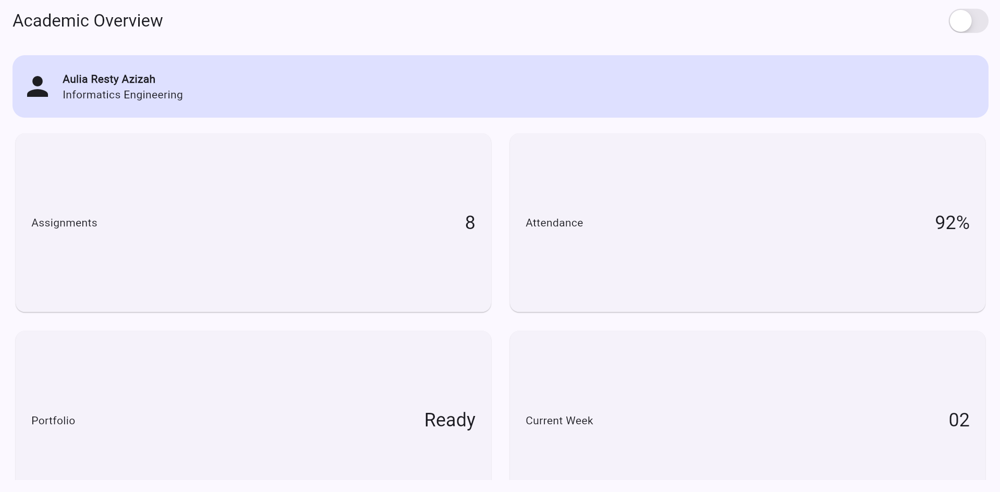

I created an Academic Overview page with a profile header and four information cards. The page supports one column on narrow screens and two columns on wider screens. It also has light/dark mode and a dark mode switch.

---

## AI Prompt Challenge

### 1. GridView vs LayoutBuilder + Column

`GridView` is useful for displaying cards in rows and columns.
`LayoutBuilder` checks the available width and helps decide when the layout should change.

I used `LayoutBuilder` with `GridView` for the responsive dashboard.

### 2. Expanded

`Expanded` makes a widget use the available space inside a `Row` or `Column`. It can cause overflow when the children need more space than the parent provides.

---

## Refactoring Challenge

1. The `DashboardCard` has been converted into an `InfoCard` that accepts two parameters: `title` and `value`. By using a single `InfoCard` widget, four information cards can be created without repeatedly writing the same `Card` structure.
2. The profile color uses `Theme.of(context).colorScheme.primaryContainer` so that the appearance adapts to both light and dark themes.
3. The responsive breakpoint has been moved to a constant: `const kWideBreakpoint = 700.0;`.
4. Project analysis performed using `flutter analyze`.
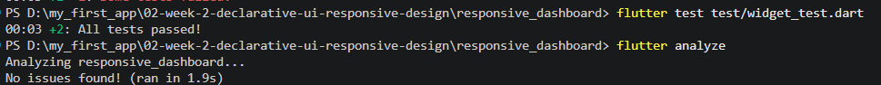

---

## Testing

---

## Reflection
### 1. How does imperative thinking differ from declarative thinking when building UI?

Imperative thinking focuses on telling the program how to do something step by step. Declarative thinking focuses on describing what the UI should look like based on the current state. So, the main difference is that imperative thinking focuses on the steps to change the UI, while declarative thinking focuses on the final UI that should be shown.

### 2. When does Expanded help, and when can it cause a layout error?

Expanded helps when we want a widget inside a Row or Column to use the available space. For example, in the profile header, Expanded allows the name and study program text to use the remaining space beside the icon. However, Expanded can cause a layout error when its parent does not have enough available space. If the content inside it needs more space than the parent can provide, Flutter can show an overflow warning.

### 3. How do breakpoints and themes affect user experience?

Breakpoints help the application adjust its layout based on the screen width. In this project, the dashboard uses one column on a narrow screen and two columns on a wider screen. This makes the cards easier to see and prevents the layout from becoming too crowded.

Themes affect the visual appearance of the application. Light and dark themes can make the app more comfortable to use in different conditions. The dark mode switch also gives users control over which theme they prefer.

So, both breakpoints and themes help make the application more comfortable, readable, and easier to use.

### 4. What did you verify after receiving an AI design recommendation?

After receiving the AI recommendation, I did not directly use it without checking it first. I verified whether the suggested layout was suitable for the project and whether the Flutter widgets could work correctly.

I checked the responsive layout using different screen sizes, including 400 × 800 and 1200 × 800. I also checked the use of Expanded, the dark mode switch, and Semantics.