# Week 3 - Navigation & State Management

---

## 2. Navigation Concepts and GoRouter

### 1. Home Page

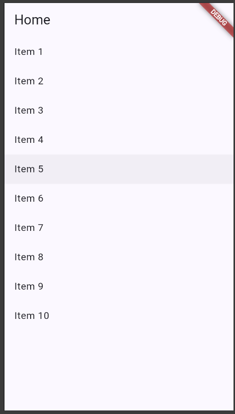

### 2. Detail Page

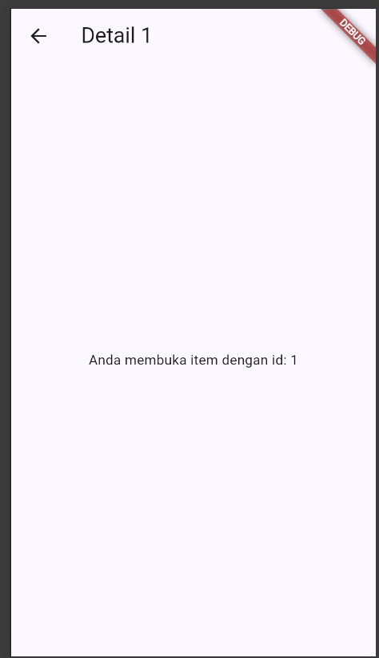

### 3. Route Parameter

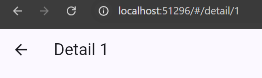

The detail page uses a route parameter to display the selected item ID. For example, when opening `/detail/1`, the page displays the detail for item 1.

I also tested accessing the detail route directly without going through the Home page. The same route can be opened directly using its path.

---

## 3. State Management with Riverpod

### 1. Add ToDo

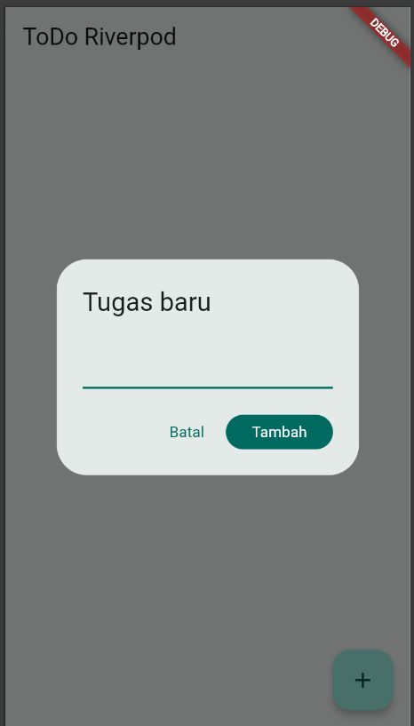

### 2. Complete ToDo

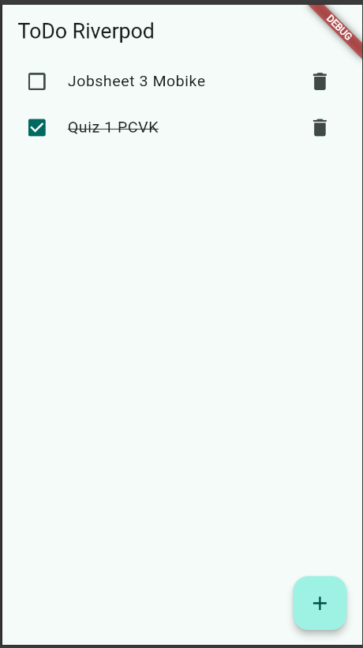

---

## 4. AsyncValue: Loading, Error, and Success

### 1. Loading State

The application shows a loading indicator while waiting for the data.

### 2. Error State

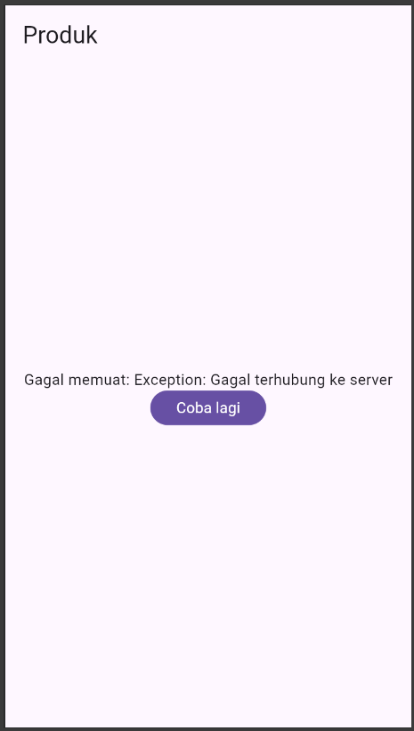

When I change the `build()` method to throw an exception. The application showed the error message and the **Coba lagi** button.

### 3. Success State

After restoring the original code and retrying, the application successfully displayed the product data.

### 4. Reflection

**Why can showing stale data with a refresh indicator be better than clearing the screen?**

Showing the old data lets users still see the previous information while the new data is loading. It can make the application feel faster because the screen does not become empty during the refresh. This pattern is useful when the data takes some time to load, users can still use or see the existing data while waiting for the updated data.

---

## 5. AI Challenge

### 1. AI Prompt

> Create a Flutter page named `StatsPage` using `flutter_riverpod`.
>
> Requirements:
>
> - A `ConsumerWidget` utilizing an `AsyncNotifierProvider` that simulates
>   fetching statistical data (2-second delay, with a 30% failure rate).
> - The UI must handle loading (spinner), error states (message + retry button),
>   and success states (a `ListView` with 3 items).
> - Include a unit test for the notifier.
>
> Explain each part of the code using comments.

### 2. Statistics Page

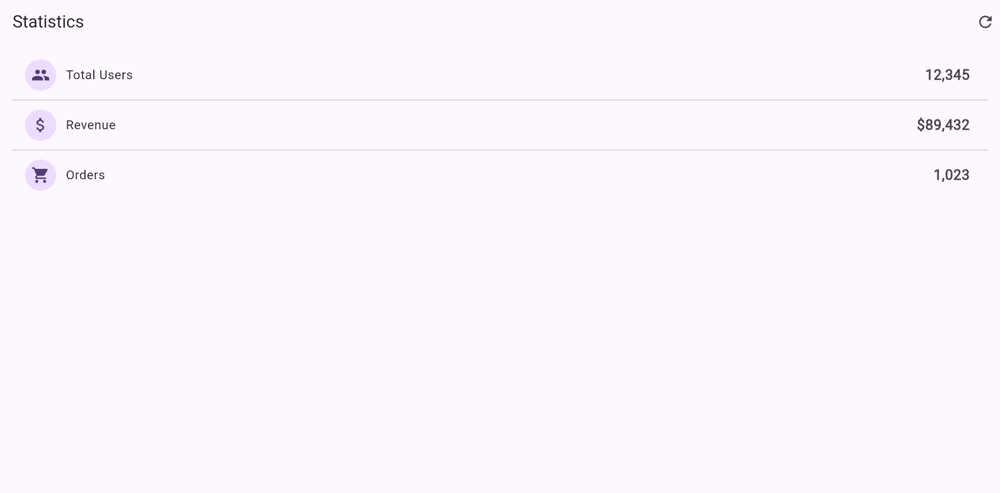

The page shows statistics data after the loading process is completed.

### 3. Error State

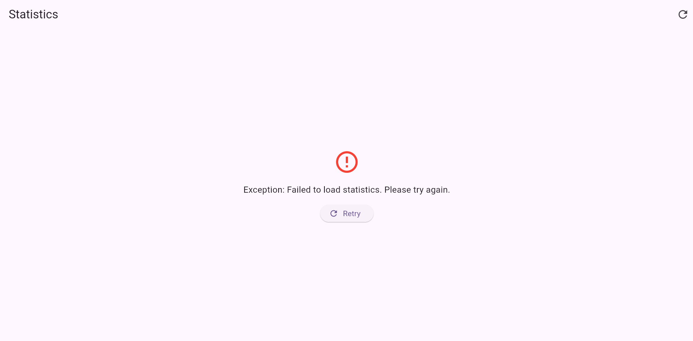

The application shows an error message and a retry button when the data fetching fails.

### 5. AI Verification

I checked the generated code based on the verification checklist from the jobsheet.

| Checklist | Result |
|---|---|
| Immutable state | Passed. The list is not modified directly. |
| `ref.watch` and `ref.read` usage | Passed. `ref.watch` is used in `build`, while `ref.read` is used in callbacks. |
| Loading, error, and success states | Passed. All three states are handled. |
| Explicit provider type | Passed. The provider has an explicit type. |
| Riverpod API | Passed. The code uses `AsyncNotifier` and `ConsumerWidget`. |

### 6. Testing

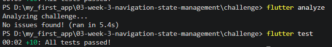

---

## 6. Refactoring and Testing

### 1. TodoTile

I separated the ToDo item into a `TodoTile` widget. This refactoring mainly changes the code structure, so there is no significant visual change in the application.

### 2. Filter Provider

I added `unfinishedTodosProvider` to show only unfinished tasks.

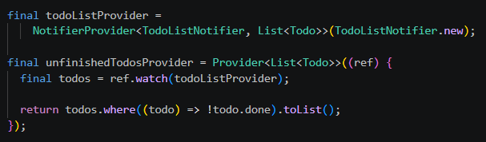

When a task is checked, it is immediately removed from the list because the page only displays unfinished tasks.

### 3. GoRouter and NavigationBar

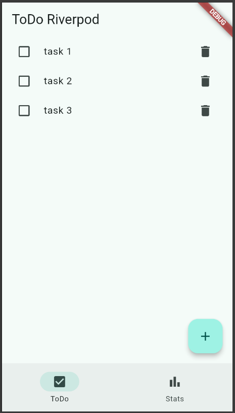

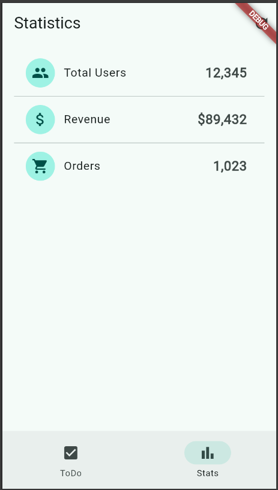

### 4. Widget Testing

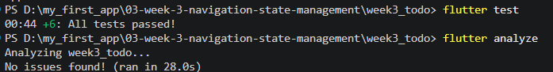

---

# Reflection

### 1. When is `setState` enough, and when should state use Riverpod?

If the data needs to be used in a few pages, we need to use Riverpod.

### 2. What is the difference between `context.go` and `context.push`, and when is each appropriate?

Both of them are used to move into another page, but `context.push` still saves the previous page and the user can go back to the previous page using the back button. `context.go` is usually used to move into the main pages, meanwhile `context.push` is used to open a detail page.

### 3. How does `AsyncValue` prevent bugs compared to three separate booleans?

`AsyncValue` makes the state clearer because it has loading, error, and success in one state. So we don't need to make a lot of booleans that can make the condition confusing.

### 4. Which part of the AI result did you fix, and why?

I did not make any changes to the AI result because the code already followed the requirements. I checked the code and tested it to make sure the loading, error, and success states worked correctly.