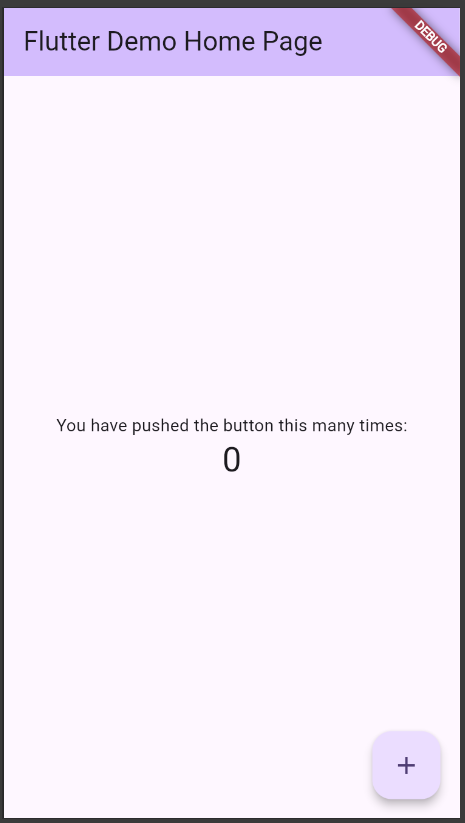
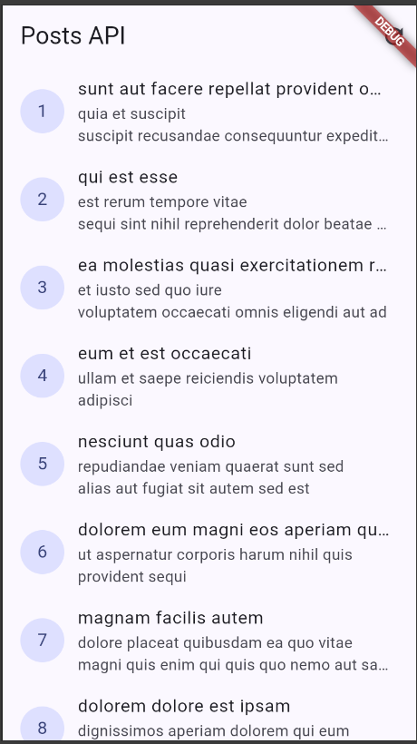
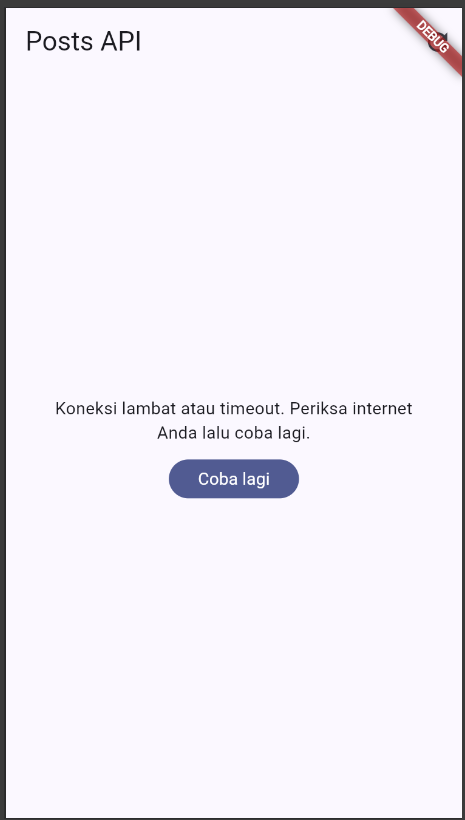
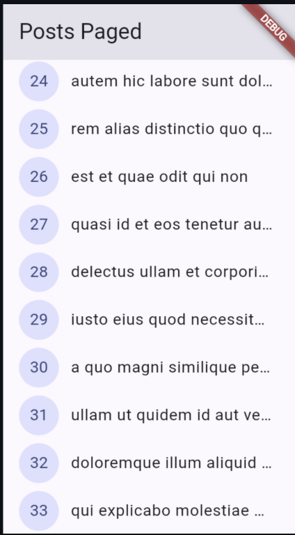
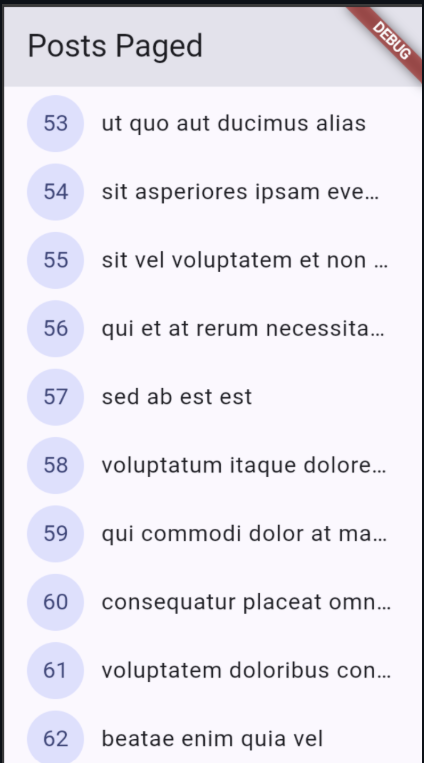
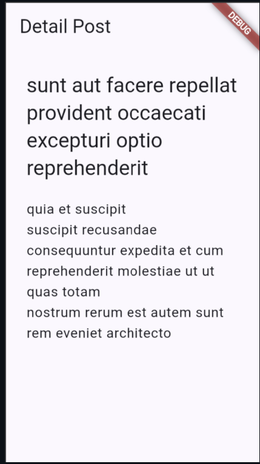
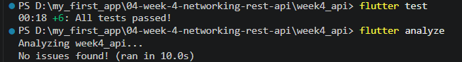

# Week 4 - Networking & REST API

### Practicum 1: Dio and data models

## Practicum 2: Providers and error handling

### 1. Normal Internet

### 2. No Internet Error

### 2. Wrong baseUrl Error

## Practicum 3: Basic Pagination

### Result

---

## 5. AI Challenge

### 1. AI Prompt

Create a Flutter repository layer for GET /comments?postId={id} from JSONPlaceholder using Dio and flutter_riverpod. Add a null-safe Comment model with fromJson and toJson, a CommentRepository with fetchComments(postId) and a 10-second timeout, an AsyncNotifierProvider with proper AsyncError handling, friendly messages for timeout, connection error, 404, and 500, and at least one unit test for missing JSON fields. First inspect the existing project structure and reuse the current API client, Dio configuration, error handling, and architecture. Do not make UI call Dio directly. After implementation, run flutter analyze and flutter test, fix any issues, and briefly explain what you created, what you changed from the initial AI output, and why.

### 5. AI Verification

| # | Checklist | Status |
|---|---|---|
| 1 | UI tidak memanggil Dio langsung | 🟩 Lulus |
| 2 | `fromJson` null-safe dengan fallback | 🟩 Lulus |
| 3 | Semua `DioExceptionType` dipetakan | 🟩 Lulus |
| 4 | `baseUrl` / timeout terpusat | ⚠️ Ada duplikasi timeout di repository |
| 5 | Test menguji edge case field hilang | 🟩 Lulus |

---

## 6. Refactoring and Testing

### Result

---

# Reflection

### 1. Why is the UI prohibited from calling Dio directly? What breaks if this rule is violated?

The UI should only handle presentation. Dio should be handled by the Repository. If the UI calls Dio directly, the code becomes harder to maintain and test.

### 2. When is client-side pagination sufficient, and when should one rely on server-side pagination (`_page`/`_limit`)?

Client side pagination is enough for small data. Server side pagination is better for large data because the app only loads the needed data, such as 10 items per request.

### 3. How do repository exceptions transform into `AsyncError` without needing a `try/catch` block in every widget? When is an explicit `try/catch` still necessary?

The Repository exception is passed to Riverpod, and AsyncNotifier represents it as AsyncError. Explicit try/catch is still needed for custom error handling or fallback logic.

### 4. Which parts of the AI-generated output did you modify, and why?

I did not make any changes to the AI result because the code already followed the requirements. I checked the code and tested it to make sure it worked correctly.