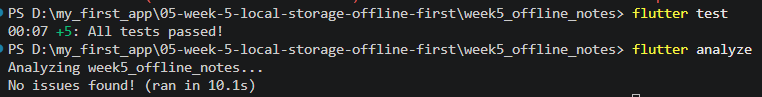
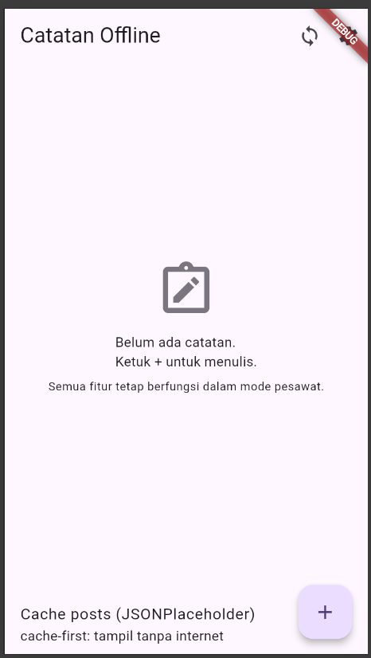
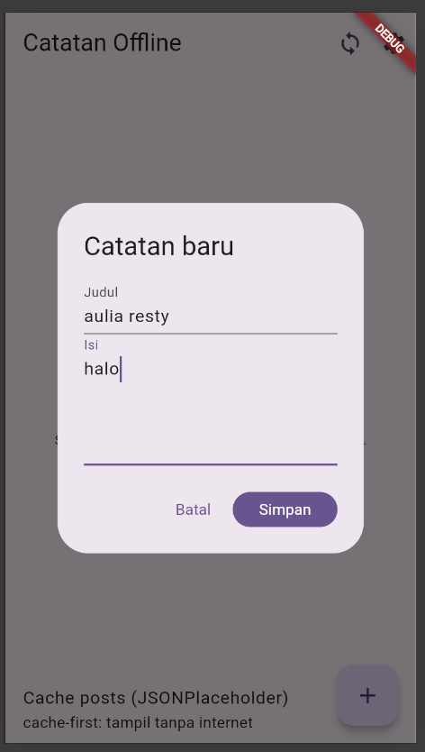
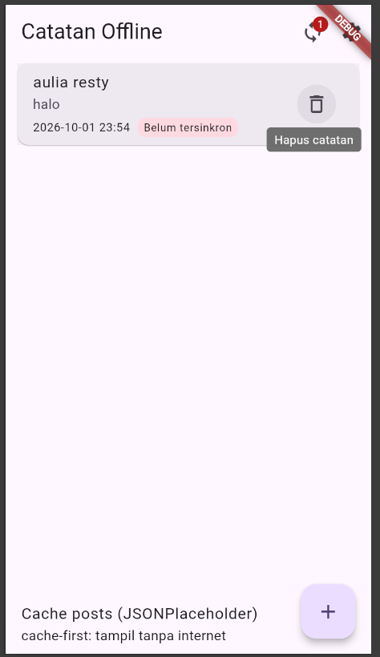
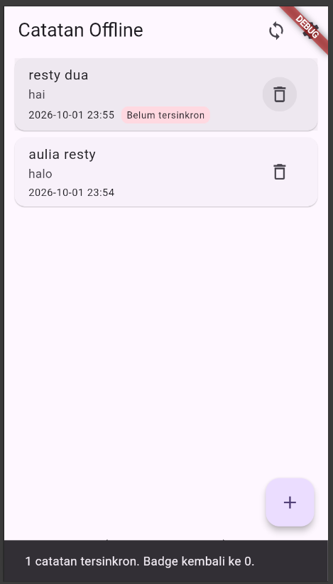
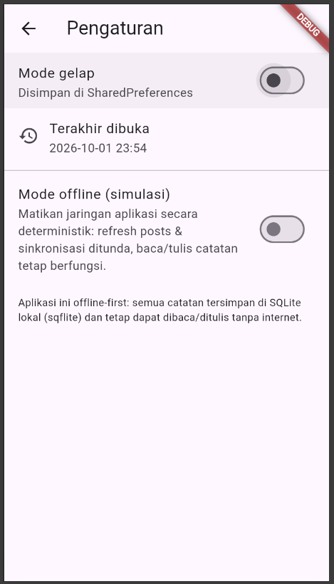

# Week 5 — Local Storage & Offline-First (Flutter Notes)

### AI Prompt
Compare SharedPreferences, Hive, sqflite (SQLite), and Drift for an offline Flutter Notes app with CRUD notes and theme preferences, covering query complexity, relationships, stream reactivity, type safety, boilerplate, testing, trade-offs, final recommendations for each use case, and a table/schema design for 1,000+ notes.

### AI Verification Checklist

| # | Verification Question | Finding | Status |
|---|---|---|---|
| 1 | Does AI use SharedPreferences for notes? | **No.** Notes use **sqflite**, while SharedPreferences is only for theme and last-opened data. | ✅ Accepted |
| 2 | Does the schema support sync? | **Yes.** It uses `dirty` and `updated_at` to mark notes that need syncing. | ✅ Accepted |
| 3 | Does AI use streams for real-time updates? | **No.** sqflite has no built-in stream. Riverpod refreshes data after changes, while **Drift** supports streams with `watch()`. | ✅ Verified |
| 4 | Is the boilerplate estimate realistic? | **Yes.** sqflite needs manual SQL and data mapping, while Drift is more convenient but requires `build_runner`. | ✅ Verified |
| 5 | What is the final decision? | **SharedPreferences** for preferences and **sqflite** for notes. **Drift** is an alternative when streams and type-safety are needed. | ✅ Documented |

Detail analisis per kriteria (query, relasi, stream, type-safety, boilerplate,
testing) dan skema 1000+ catatan: [`docs/storage-comparison.md`](docs/storage-comparison.md).

### Uji   

### Hasil yang dicapai

### Refleksi

1. Daftar catatan tidak boleh di SharedPreferences karena harus rewrite penuh setiap simpan, tanpa query, tipe, atau relasi — akan bermasalah saat data banyak.
2. Cache-first cukup untuk data yang boleh sedikit usang seperti posts atau daftar. Untuk harga real-time, gunakan network-first.
3. Dirty flag → antrean sync yang diproses di background agar UI tidak terblokir. Outbox diperlukan jika antrean harus tetap ada setelah restart atau sync semakin panjang.
